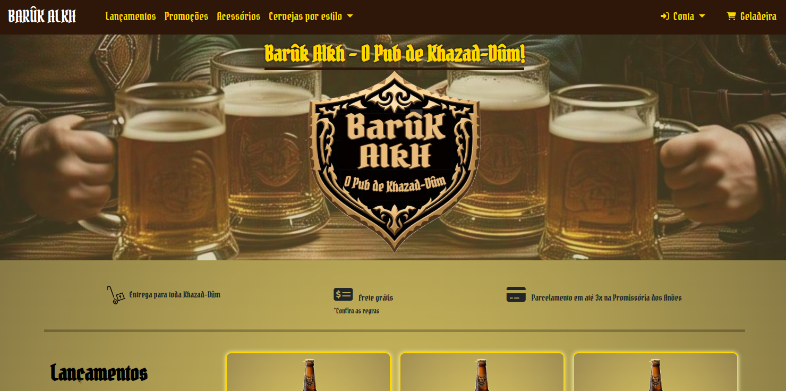
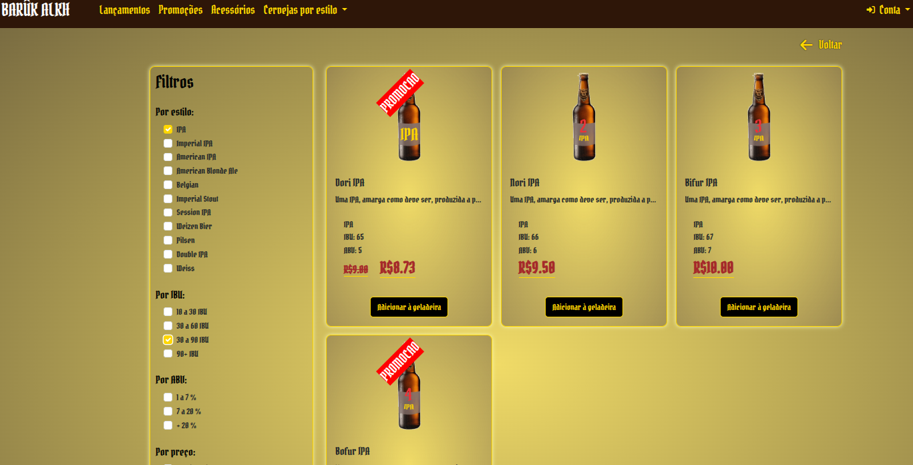
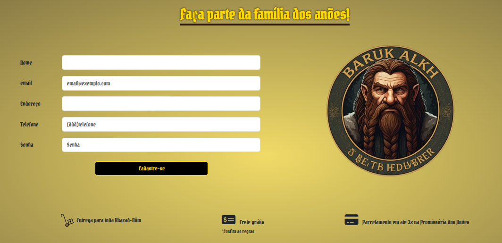
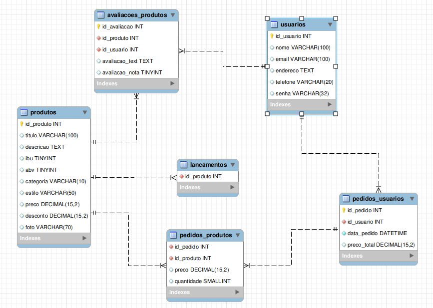

 <h1> E-Commerce de Cerveja em PHP </h1> 

 <h3> Esse repositório contém arquivos do projeto em PHP de um e-commerce de cervejas e acessórios. </h3> 

 <h4><a href="https://barukalkh.patrikgogola.com.br/index.php" target="_blank">Acesse o projeto publicado!</a></h4> 

 
 
<ul>
  <li><h3>Contexto</h3></li>
 </ul>

    O projeto consiste em um E-commerce de cervejas e acessórios.Essa loja possui como tema central
    os Anões fictícios dos livros de <i>J.R.R. Tolkien</i>. A loja física estaria situada no reino de Khazad-Dûm o qual esta sob as Montanhas Nevoentas. A loja tem como objetivo central atender os anões que trabalham nas minas e vende cervejas que levam em suas receitas ingredientes produzidos por toda <a href="https://terramedia.fandom.com/wiki/E%C3%A4">Ëa</a>.

    As imagens utilizadas no projeto foram todas geradas utilizando Inteligência Artificial com excessão das garrafas de cerveja e seus rótulos simples que foram desenvolvidos por mim utilizando Corel Draw.

  

 
 

<ul>
  <li><h3>Sobre</h3></li>
</ul>

    Esse projeto foi desenvolvido com a intenção de somar ao meu portfólio pessoal e poder aplicar e mostrar, a quem possa interessar, meus conhecimentos nas tecnologias utilizadas.  

    Ele foi desenvolvido utilizando <strong style="color:rgb(204, 123, 48);" >HTML</strong>, <strong style="color:rgb(56, 87, 189);">CSS</strong>, <strong style="color:rgb(107, 56, 189);">BOOTSTRAP</strong>, <strong style="color:rgb(199, 185, 62);">JavaScript</strong>, <strong>PHP</strong>, banco de dados <strong style="color:rgb(39, 55, 109);">My</strong><strong style="color:rgb(189, 132, 8);">SQL</strong> e diversas requisições assíncronas utilizando <strong style="color:rgb(8, 119, 14);">AJAX</strong>.

    

    

 
 
 

    Para salvar trabalhar as informações de cadastro de usuários, produtos, avaliações, pedidos, etc, foi utilizado o esquema MySQL. As senhas dos usuários são criptografadas e as imagens não são salvas no BD e sim na pasta do projeto.
    O esquema pode ser visto abaixo:

  

 
 
 

<ul>
  <li><h3>Próximos passos</h3></li>
</ul>

 
    Dentre os próximos passos para esse projeto, os mais importantes seriam:
    <ul>
        <li>
            Melhorar alguns aspectos gerais do site como melhores notificações e alertas para as ações realizadas.
        </li>
        <li>
            Implementar, utilizando o <b>PHPMailer()</b>, o envio de email de confirmação para finalizar o cadastrado dos usuários.
        </li>
        <li>
            Implementar, utilizando o <b>PHPMailer()</b>, o envio de email de confirmação para alterar os dados do usuário.
        </li>
        <li>
            Integrar o carrinho da loja a uma API de Pagamento.
        </li>
        <li>
            Integrar o carrinho da loja a uma API de cálculo de frete.
        </li>
        <li>
            Implementar um sistema <b>ERP</b> para a administração background da loja.
        </li>
    </ul>
    

 
 
 

 <h3>O projeto esta publicado em meu portófio e pode ser visualizado <a href="https://barukalkh.patrikgogola.com.br/index.php" target="_blank">clicando aqui!</a></h3> 

 

 <h3>Para visualizar meu portfólio pessoal e saber mais sobre mim e outros projetos, <a href="https://www.patrikgogola.com.br/" target="_blank">clique aqui!</a></h3> 
